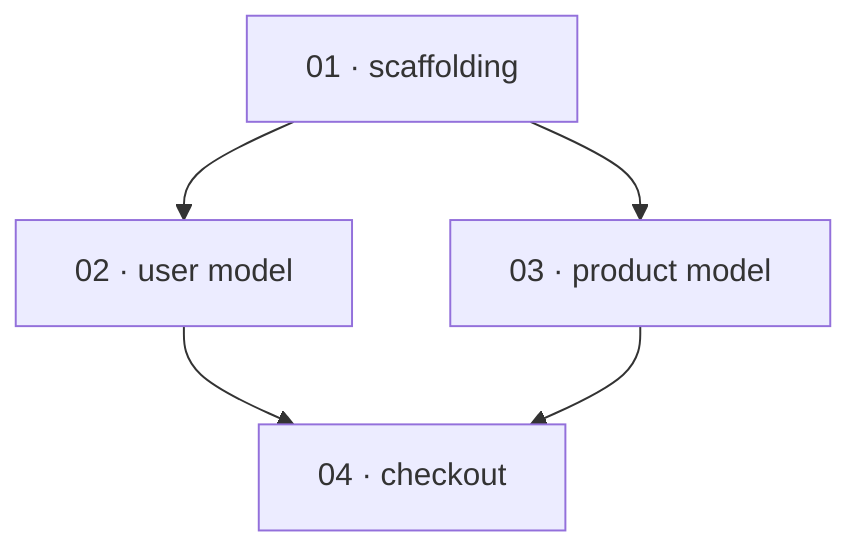

# Implementation Planner

> **Pi harness:** Before executing this skill, read [`PI-HARNESS.md`](../../PI-HARNESS.md). It defines the available-tool, sub-agent dispatch, question, research, git, and validation conventions that override generic runtime wording below.

Turn a spec into an **initial implementation plan**: the single high-level document that captures the technical approach, the tech stack, and every phase of the build, in enough detail that an implementing agent can later expand any one phase into concrete tasks.

You are acting as the **technical subject-matter expert**. The spec defines *what* to build and deliberately contains no technical decisions. Your job is to make sound, defensible technical decisions that stay faithful to the spec — and to record those decisions so a human can review or reverse them.

This skill produces a *plan*. It does not implement features and it does not break a phase into tasks. It is the second of four pipeline stages: **`spec-writing`** produces `.spec/spec.md` (your input) → **this skill** produces the initial plan and the conventions doc → **`phase-planner`** expands one phase at a time → **`implementation-orchestrator`** builds each planned phase. After the initial plan is approved, `phase-planner` takes over — expanding ready phases one doc at a time, and several in parallel when the phase dependency graph shows they're independent.

## What you produce

Two files in the shared **`.spec/`** workspace — the same directory the spec lives in, so the whole pipeline reads and writes one place:

- **`.spec/00-initial-plan/plan.md`** — the initial plan (template below). Everything an implementing agent needs lives in or is referenced from this file.
- **`.spec/00-initial-plan/conventions.md`** — the project's coding conventions: naming, error handling, test layout, structure (template below). The orchestration stage hands this verbatim to every implementation sub-agent so the codebase stays coherent. On a greenfield project there is no existing code to infer conventions from, so **you establish them here** — nothing else in the pipeline does.

Phase documents (`.spec/00-initial-plan/phase-NN-<slug>/phase-NN-<slug>.md`) are created later by `phase-planner`, one at a time.

## Workflow

Work through these steps in order. Do not skip the research or review steps — they are what make the plan trustworthy.

### 1. Gather and confirm inputs

Read the spec at **`.spec/spec.md`** — the canonical location `spec-writing` writes to. If it lives elsewhere, confirm the path with the user. Locate any supporting documentation (design docs, API contracts, brand guidelines, existing-code references) and ask whether other documents should inform the plan. Read everything before planning.

### 2. Resolve genuine gaps — but don't invent requirements

As SME you should fill in *unspecified-but-inferable* technical choices yourself (e.g. which HTTP client, how to structure config). But when the spec is genuinely ambiguous about *what the product should do* — a missing requirement, a contradiction, an unstated user-facing behavior — surface it as a question rather than guessing. The line: infer technical means freely; ask about unclear product ends.

### 3. Choose the tech stack (research first)

Dispatch a research sub-agent directed to use the **`plan-research`** skill (full-stack pass) **before** committing to a stack — current reality changes choices, and a library you'd reach for from memory may be unmaintained or superseded. Hand it the proposed components and any fixed constraints; fold the versions it returns into the plan, pinning specific, verified-current stable ones with the date checked. If your runtime has no sub-agents, run that skill's process yourself.

If the user specified a language, libraries, or tools, use them (still research their current versions and compatibility). If they did **not** specify a programming language and the repository does not settle it, use `ask_user` once with your top 3–5 candidates as actionable options, each with an honest trade-off, plus your recommendation and a custom-answer path. Continue only after that material choice. See "Presenting stack options" below.

Record every non-obvious decision in the plan's Technical Decisions section (see "Logging decisions").

### 4. Decide coding conventions

Decide the project's coding conventions and capture them in `.spec/00-initial-plan/conventions.md`: naming, error-handling approach, test layout and naming, project/directory structure, and any formatting or linting rules. These flow directly into every implementation sub-agent downstream, so being explicit here is what keeps a multi-agent build from becoming a patchwork. Keep them consistent with the stack chosen in step 3.

### 5. Decompose into phases and map their dependencies

Break the build into phases. **Err toward more, smaller phases** — the goal is that no phase ever needs to be split into sub-phases later. Use the sizing heuristic below. For each phase capture its goal, scope, deliverables, the spec requirements it satisfies, its definition of done, the key areas it touches, and — importantly — the **exact phases it depends on**.

Treat those dependencies as a directed graph, because it determines how much of the build can run in parallel:

- An edge **A → B** means B genuinely needs something A produces (a module, a schema, an interface). Add an edge only when the dependency is real.
- **Don't add ordering edges for convenience.** A false "B after A" edge that isn't a real dependency needlessly serializes work the orchestrator could otherwise run at the same time. Phases with no path between them are independent.
- Note **resource contention**: two phases that are logically independent but heavily rewrite the same files will collide if built concurrently. Flag them so the build serializes them despite there being no data dependency.

Record the result in the initial plan's **Phase dependency graph** section (template below). See "Mapping dependencies and parallelism" for how to derive the waves.

Cover the whole lifecycle, not just features: include phases (or explicit per-phase requirements) for project scaffolding, testing, observability/logging, CI/CD, and deployment, since the spec will not mention these.

### 6. Review before finalizing

Spawn a review sub-agent (fresh context) directed to use the **`plan-review`** skill in initial-plan mode, and give it the spec and your drafted plan. It checks that phases are properly scoped, that the plan adheres to the spec (covers every requirement, invents nothing beyond it without a logged decision), and that the phase dependency graph is sound (acyclic, no false edges, conflicts flagged), returning a severity-ranked issue list. Address every finding, blockers first, and re-review until it passes — cap at ~3 rounds, then escalate any unresolved items to the user rather than spinning. (If your runtime has no sub-agents, run that skill's checklist yourself as a deliberate fresh-eyes pass.) Then write the plan.

### 7. Write the initial plan and conventions

Write `.spec/00-initial-plan/plan.md` using the exact initial-plan template below, and `.spec/00-initial-plan/conventions.md` using the conventions template below.

### 8. Present for approval

Summarize the plan, then use one `ask_user` approval gate with **Approve**, **Request changes**, and **Stop** options. Iterate on requested changes. The initial plan is the major commitment point — do not move to phase planning until the user approves it.

## Presenting stack options

When no language is specified, turn this content into one structured `ask_user` choice:

```
For this project I'd recommend considering:

1. <Language/stack> — <one-line why it fits this spec>. Trade-off: <honest downside>.
2. <Language/stack> — <why>. Trade-off: <downside>.
3. <Language/stack> — <why>. Trade-off: <downside>.

My recommendation: <pick> because <reason tied to the spec>.

Which would you like to build on?
```

Tie each option to *this* spec's actual needs (e.g. real-time requirements, team familiarity if known, deployment target), not generic popularity.

## Phase sizing heuristic

A well-sized phase is a coherent, independently reviewable slice with **one clear deliverable**, roughly demoable on its own, and small enough to fit a focused work session. When in doubt, split.

**Good:** "Phase 3 — User authentication: email/password signup, login, session management, and password reset, with tests." One coherent capability.

**Too big** (split it): "Phase 2 — Build the entire backend." No single deliverable; will need sub-phases.

**Too small** (merge it): "Phase 5 — Add a logout button." Not independently meaningful; folds into the auth phase.

## Mapping dependencies and parallelism

The phase dependency graph is what lets the build run more than one phase at a time. Keep two consistent views:

- **Dependency edges** (authoritative): each phase's `Depends on` list. Together they form a DAG.
- **Execution waves** (derived): wave 1 is every phase that depends on nothing; wave 2 is every phase whose dependencies are all in wave 1; and so on. Phases in the same wave have no dependency between them, so they can be built in parallel.

At build time the rule is simply **a phase is ready the moment every phase it depends on is Complete** — the orchestrator can start it then, without waiting for the rest of its wave. The waves are a planning-time illustration that makes the shape obvious; the dynamic readiness rule extracts a bit more parallelism.

For example, a plan where phases 02 and 03 each build on 01, and 04 needs both:



Waves: **1:** 01 → **2:** 02, 03 (in parallel) → **3:** 04.

Two cautions:
- **Foundations serialize.** Scaffolding, shared schema, and core domain types are depended on by almost everything, so they sit alone in early waves. That's expected — don't fabricate parallelism that isn't there.
- **Independent ≠ conflict-free.** Phases with no dependency edge can still clash if they rewrite the same files. Flag such pairs as *resource conflicts*; they're safe to build in either order, but not at the same time.

## Logging decisions

Because you are making technical calls the spec didn't, each non-obvious decision needs its reasoning and the main alternative you rejected, so the choice is reviewable and reversible. These **Technical Decisions** are the middle tier of the workflow's decision trail — `spec-writing` logs product **Decisions** above you, `implementation-orchestrator` logs implementation-time **ADRs** below. Example entry:

```
- **Database: PostgreSQL 16.x.** The spec requires relational reporting across
  orders and users; Postgres gives strong relational guarantees and mature
  tooling. Rejected: MongoDB (relational joins would be awkward for the
  reporting requirement).
```

## File locations

The shared workspace is a **`.spec/`** directory at the repository root — the same directory the spec lives in. The spec sits at its root (`.spec/spec.md`); everything for this plan lives under a single plan folder, `.spec/00-initial-plan/`, which keeps the workspace root uncluttered. Initial plan: `.spec/00-initial-plan/plan.md`. Conventions: `.spec/00-initial-plan/conventions.md`. Each phase gets its own sub-folder under the plan folder, holding that phase's doc and — added later by the build stage — its state and report. Phase documents (created later by `phase-planner`): `.spec/00-initial-plan/phase-01-<slug>/phase-01-<slug>.md`, `.spec/00-initial-plan/phase-02-<slug>/phase-02-<slug>.md`, etc. The orchestration stage later adds its own artifacts to the same tree: each phase build writes its task-state and report inside that phase's own folder (`.spec/00-initial-plan/phase-NN-<slug>/state.md` and `.spec/00-initial-plan/phase-NN-<slug>/report.md`) — so standalone and parallel builds use the same paths and never collide — and a full parallel build (`phase-implementation-orchestrator`) writes one aggregate `.spec/00-initial-plan/build-report.md`; ADRs land in `.spec/00-initial-plan/adr/`. If the project clearly keeps docs elsewhere, adapt, but keep the naming convention so every stage can find the others reliably.

## Initial plan template

ALWAYS use this exact structure:

```markdown
# <Project name> — Initial Implementation Plan

## Progress tracker
<!-- The phase-level index. A phase is "ready" once every phase in its `Depends on` is Complete; more than one can be ready — and In progress — at once. `phase-planner` sets a row to "In progress" when it writes that phase's doc; `implementation-orchestrator` sets it to "Complete" once the phase is built, gated, and committed. Each Complete flip can unblock further phases — consult the Phase dependency graph for what becomes ready. -->
| Phase | Name | Status | Phase doc |
|-------|------|--------|-----------|
| 01 | <name> | Not started | — |
| 02 | <name> | Not started | — |
<!-- Status: Not started / In progress / Complete -->

## Spec reference
- Source: `.spec/spec.md`
- Summary: <2–4 sentence plain summary of what the product must do>

## Technical decisions
<!-- Every non-obvious choice with rationale + rejected alternative. -->
- **<decision>.** <rationale>. Rejected: <alternative> (<why not>).

## Tech stack
<!-- Pinned, research-verified versions. Note the date checked (see research.md). -->
| Component | Choice | Version | Notes |
|-----------|--------|---------|-------|

## Architecture overview
<short prose + the key components and how they interact>

## Non-functional requirements
- **Testing strategy:** <approach, frameworks, coverage expectations>
- **Error handling:** <approach>
- **Security:** <auth, secrets, data handling>
- **Observability:** <logging, metrics, tracing>
- **CI/CD:** <pipeline, gates>
- **Deployment target:** <where/how it runs>
- **Coding conventions:** see `.spec/00-initial-plan/conventions.md` (this plan establishes it; every implementation sub-agent follows it).

## Non-goals / out of scope
- <thing the project deliberately will not do>

## Risks and open questions
- <risk or unresolved question, with current thinking>

## Requirement → phase traceability
<!-- Keyed on the spec's REQ-NNN IDs so the chain stays stable end to end. Guarantees nothing in the spec is dropped; powers the spec-adherence review. -->
| Spec requirement (REQ-ID) | Covered by phase(s) |
|---------------------------|---------------------|

## Phase dependency graph
<!-- Derived from each phase's `Depends on` (the authoritative edges); regenerate if those change. Drives parallelism: a phase is ready once every phase it depends on is Complete. See "Mapping dependencies and parallelism" in the skill. -->
<`mermaid graph TD` diagram — one node per phase, arrows pointing prerequisite → dependent>

**Execution waves** (phases in the same wave can be built in parallel):
- **Wave 1:** <phases that depend on nothing>
- **Wave 2:** <phases whose dependencies are all in wave 1>
- <…>

**Resource conflicts** (independent phases that must NOT run concurrently because they rewrite the same files — safe in either order, not at once):
- <phase & phase — shared area, e.g. `api/routes/`> (or "none")

## Phases

### Phase 01 — <name>
- **Goal:** <what this phase achieves>
- **Scope:** <what's included>
- **Deliverables:** <concrete outputs>
- **Key areas touched:** <main files/modules/dirs — so resource conflicts between parallel phases are visible>
- **Depends on:** <the exact phases this one needs, by number, or "none" for a root phase that can start immediately>
- **Spec requirements covered:** <REQ-IDs>
- **Definition of done:** <verifiable criteria that gate this phase as complete>

### Phase 02 — <name>
...
```

## Conventions template

ALWAYS use this exact structure for `.spec/00-initial-plan/conventions.md`:

```markdown
# <Project name> — Coding Conventions

> Established by the initial plan. Read by `implementation-orchestrator` and passed to every implementation and review sub-agent.

## Languages & formatting
<language version(s), formatter + config, lint ruleset>

## Naming
<files, modules, types, functions, variables, test files>

## Project structure
<directory layout; where source, tests, config, and docs live>

## Error handling
<how errors are raised/returned, logged, and surfaced; error types>

## Testing
<framework, test layout, file/test naming, what a "meaningful test" means here, coverage expectations>

## Dependencies & imports
<import style, dependency boundaries, what may depend on what>

## Comments & docs
<docstring/comment expectations; what must be documented>
```

## Sub-agent skills

This skill dispatches two sub-agents, each its own skill — the planning stage's mirror of `spec-research`/`spec-review` at the spec stage and `codebase-explorer`/`code-reviewer` at the build stage:

- **`plan-research`** — verifies current, stable, compatible dependency versions (and flags abandoned or vulnerable ones). Dispatch it in the **full-stack pass** before choosing the stack (step 3); it returns verified versions with sources and the date checked, which you fold into the plan.
- **`plan-review`** — audits the drafted plan against the spec for scope, spec adherence, and a sound phase dependency graph. Dispatch it in **initial-plan mode** before finalizing (step 6); it returns a severity-ranked issue list to act on.

Both carry their own rubric, so they are self-contained when invoked. If your runtime has no sub-agents, run each skill's process yourself as a deliberate, separate pass.
