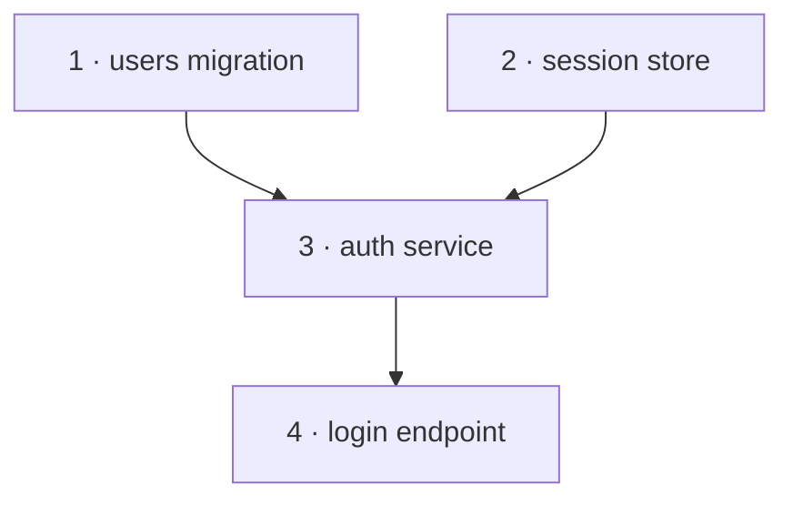

# Phase Planner

> **Pi harness:** Before executing this skill, read [`PI-HARNESS.md`](../../PI-HARNESS.md). It defines the available-tool, sub-agent dispatch, question, research, git, and validation conventions that override generic runtime wording below.

Expand **one** phase of an approved initial implementation plan into a detailed, task-level document an agent can implement directly.

Produce exactly one phase document per run — a phase that is **ready**, meaning every phase it depends on is already built. **Never plan ahead of a phase's dependencies.** This is deliberate: a phase doc is written *after* the phases it builds on are actually built, so it can account for anything that changed during their implementation. Planning past unmet dependencies re-introduces the drift this design exists to prevent.

When several phases are ready at once — their dependencies all Complete and they don't depend on each other — they are independent and may be planned and built **in parallel**: run this skill once per ready phase. Parallelism never overrides the dependency rule; a phase whose dependencies aren't all Complete is simply not ready yet.

This skill produces a *plan for one phase*. It does not implement the feature code itself — that's the **`implementation-orchestrator`** skill, which builds the phase from the document this skill creates and then marks the phase Complete in the initial plan. This is the third of four pipeline stages: `spec-writing` → `implementation-planner` → **this skill** → `implementation-orchestrator`. When the whole plan is built at once, **`phase-implementation-orchestrator`** drives this skill and `implementation-orchestrator` across the initial plan's phase graph, planning and building independent phases in parallel.

## What you produce

A single phase folder `.spec/00-initial-plan/phase-NN-<slug>/` containing the phase doc `phase-NN-<slug>.md` (matching a **ready** phase in the initial plan — one whose dependencies are all Complete), following the template below, plus an updated progress tracker in the initial plan. The build stage later adds this phase's `state.md` and `report.md` to the same folder.

## Workflow

### 1. Find a ready phase

Read `.spec/00-initial-plan/plan.md` — its progress tracker and its **Phase dependency graph** — to find a phase that is **ready**: not yet Complete, with every phase in its `Depends on` already Complete. (A phase reaches **Complete** only when `implementation-orchestrator` has built, reviewed, and committed it.) If several phases are ready, they can be planned in parallel — pick one for this run and note to the user that the others are ready too. If phases remain but none are ready, their dependencies are still in flight: say so and stop. If every phase is complete, tell the user there's nothing left to plan. If no initial plan exists, stop and direct the user to the `implementation-planner` skill first.

### 2. Reconcile as-built vs. as-planned (do this before anything else)

Before writing the new phase doc, look at what this phase's **dependency phases actually produced** (the phases in its `Depends on`), not just what the plan said they would. Inspect the repository and those phase documents, and compare against the initial plan.

If reality diverged — a decision changed, a dependency was swapped, scope shifted — update the initial plan to match (decisions, tech stack, traceability, later-phase scopes) and briefly flag the significant changes to the user. This keeps every downstream phase grounded in the real state of the code. Note any divergence in the new phase doc's "Deviations" section too. One caution when `phase-implementation-orchestrator` is driving you in parallel mode: a later phase whose scope your reconciliation would rewrite might already be planned or building. Don't silently rewrite a phase that's already in flight — flag the collision to the coordinator so it can pause and re-plan that phase against the new reality, rather than leaving two versions of its scope to diverge.

### 3. Confirm specifics with fresh research

Dispatch a research sub-agent directed to use the **`plan-research`** skill (just-in-time phase pass), scoped to this phase. This is the lighter check: confirm the versions and APIs this phase will actually use are still current and unchanged since the initial plan was written, since releases move between phases. Update pinned versions if the sub-agent reports they've shifted. If your runtime has no sub-agents, run that skill's process yourself.

### 4. Break the phase into tasks

Decompose the phase into concrete, granular tasks. For each task capture what it does, the files or areas it touches, its dependencies on other tasks, the tests to write, and its acceptance criteria. Define the phase's overall definition of done (it should match or sharpen the one in the initial plan). See task granularity guidance below.

Then map the tasks' dependencies as a graph, so the orchestrator can build independent tasks with parallel sub-agents:

- A task's `Depends on` lists only the tasks whose output it genuinely needs. Don't add ordering that isn't real — a false edge serializes work that could otherwise run at the same time.
- Tasks with no dependency path between them are independent. But independent tasks that **touch the same files** will collide if built concurrently, so compare each task's `Touches` list and flag overlaps as resource conflicts.
- Record both in the phase doc's **Task dependency graph** section (template below). See "Task dependencies and parallelism" below for how to derive the waves.

### 5. Review before finalizing

Spawn a review sub-agent (fresh context) directed to use the **`plan-review`** skill in phase-doc mode, and give it the spec and your drafted phase doc. For a phase doc it checks four things: tasks are properly scoped, the doc adheres to the spec requirements this phase owns, every task stays **within this phase's boundaries** (no work that belongs to a later phase has leaked in), and the task dependency graph is sound (acyclic, no false edges, overlapping-`Touches` tasks flagged as conflicts). Address every finding, blockers first, and re-review until it passes — cap at ~3 rounds, then escalate any unresolved items to the user. (If your runtime has no sub-agents, run that skill's checklist yourself as a deliberate fresh-eyes pass.)

### 6. Write the phase document

Write `.spec/00-initial-plan/phase-NN-<slug>/phase-NN-<slug>.md` using the exact template below.

### 7. Update the tracker and present

Update the phase's row in the initial plan's progress tracker — set it **In progress** and link the new doc. (You set In progress; `implementation-orchestrator` sets Complete once it has built the phase.) Summarize the phase doc, then use one `ask_user` gate with **Approve**, **Request changes**, and **Stop** options. When an enclosing `phase-implementation-orchestrator` explicitly runs in autonomous mode, report completion to that coordinator instead; it owns approval. Then **stop** this run — one phase doc per run. Other phases that are already ready can be planned in separate runs; an unready phase waits for its dependencies.

## Task granularity

A good task is a single, verifiable unit of work — small enough that its acceptance criteria are unambiguous, large enough to be meaningful. "Create the `users` table migration with email, password_hash, and created_at columns" is a good task. "Build auth" is too coarse for a task (it's a phase). "Add a semicolon" is too fine.

## Task dependencies and parallelism

The task dependency graph lets independent tasks run as parallel sub-agents instead of one at a time. Keep two consistent views:

- **Dependency edges** (authoritative): each task's `Depends on`. Together they form a DAG within the phase.
- **Execution waves** (derived): wave 1 is every task that depends on nothing; wave 2 is every task whose dependencies are all in wave 1; and so on. Tasks in the same wave can be built at the same time.

At build time the orchestrator can use the stronger dynamic rule: **a task is ready as soon as its own dependencies are done**, without waiting for its whole wave. The waves are just the human-readable shape.

For example:



Waves: **1:** 1, 2 (in parallel) → **2:** 3 → **3:** 4.

Keep the graph honest and conflict-aware:
- **Don't invent edges.** A task depends only on what it actually consumes; spurious ordering throws away parallelism.
- **Overlapping `Touches` = a resource conflict.** Two tasks editing the same file are unsafe to run concurrently even with no data dependency between them. List such pairs so the orchestrator serializes them — order doesn't matter, simultaneity does.

## Phase document template

ALWAYS use this exact structure:

```markdown
# Phase NN — <name>

> Part of [Initial Implementation Plan](../plan.md)

## Goal
<what this phase achieves, refined from the initial plan>

## Scope and boundaries
- **In scope:** <what this phase covers>
- **Out of scope (later phases):** <explicitly what NOT to build here>

## Spec requirements covered
<the specific spec REQ-IDs this phase owns, from the initial plan's traceability matrix>

## Deviations from plan
<!-- Filled during reconciliation (step 2). "None" if the plan held. -->
<any divergence between the initial plan and the real state of the code, and how it's handled>

## Confirmed tech for this phase
<!-- From step 3 research. Note anything that changed since the initial plan. -->
| Component | Version | Changed since initial plan? |
|-----------|---------|----------------------------|

## Tasks
<!-- Listed in a workable order, but the dependency graph below governs execution. Each task is independently verifiable. -->
1. **<task name>**
   - Does: <what it implements>
   - Touches: <files/areas — compared across tasks to detect resource conflicts>
   - Depends on: <other task numbers whose output this needs, or "none">
   - Tests: <tests to write>
   - Acceptance criteria: <how to know it's done and correct>
2. **<task name>**
   ...

## Task dependency graph
<!-- Derived from each task's `Depends on` (the authoritative edges); regenerate if those change. Lets the orchestrator run independent tasks as parallel sub-agents. See "Task dependencies and parallelism" in the skill. -->
<`mermaid graph TD` diagram — one node per task, arrows pointing prerequisite → dependent>

**Execution waves** (tasks in the same wave can be built in parallel):
- **Wave 1:** <tasks that depend on nothing>
- **Wave 2:** <tasks whose dependencies are all in wave 1>
- <…>

**Resource conflicts** (independent tasks that must NOT run concurrently because they touch the same files — safe in either order, not at once):
- <task & task — shared file> (or "none")

## Definition of done
<verifiable criteria that gate this whole phase as complete — matches/sharpens the initial plan>

## Verification
<how to confirm the completed phase satisfies its spec requirements>

## Risks and open questions
- <anything unresolved for this phase>
```

## Sub-agent skills

This skill dispatches the same two planning-stage sub-agents `implementation-planner` uses, scoped to a single phase — mirroring `spec-research`/`spec-review` and `codebase-explorer`/`code-reviewer` at the other stages:

- **`plan-research`** — the **just-in-time phase pass**: confirms the versions and APIs this phase will use are still current and unchanged since the initial plan (step 3); returns any that shifted, which you update in the phase doc.
- **`plan-review`** — in **phase-doc mode**: audits this phase doc for scope, spec adherence, phase-boundary leakage, and a sound task dependency graph (step 5); returns a severity-ranked issue list to act on.

Both carry their own rubric, so they are self-contained when invoked. If your runtime has no sub-agents, run each skill's process yourself as a deliberate, separate pass.
